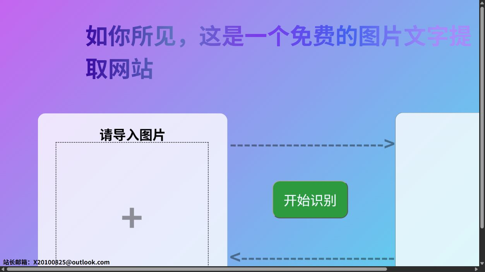

# OCR Website

我的第一个 OCR 网站练习。仓库保留了两种实现：Flask + Tesseract 的服务端版本，以及只用 HTML 和 Tesseract.js 的纯前端版本。



## 两种实现

| 版本 | 入口 | 识别位置 | 支持语言 |
| --- | --- | --- | --- |
| Flask 版 | `OCR-website/ocr.py` | 本机 Tesseract | 简体中文 + 英文 |
| 静态版 | `OCr-website(static).html` | 浏览器中的 Tesseract.js | 英文 |

## 直接体验静态版

下载仓库后，用浏览器打开 `OCr-website(static).html`。选择图片并点击“开始识别”，结果会显示在右侧文本框中。

图片在浏览器内处理，不会发送到这个项目自建的服务器。首次使用仍需联网加载 CDN 中的 Tesseract.js 及相关资源。

## 运行 Flask 版

先安装 [Tesseract OCR](https://github.com/tesseract-ocr/tesseract) 及简体中文语言数据，再进入后端目录：

```bash
cd OCR-website
pip install -r requirements.txt
python ocr.py
```

`ocr.py` 中的 `tesseract_cmd` 当前写的是 Windows 默认安装路径。如果你的安装位置不同，需要改成实际路径。

## 项目结构

```text
.
├─ OCr-website(static).html   # 纯前端 OCR
└─ OCR-website/
   ├─ ocr.py                  # Flask 服务
   ├─ requirements.txt
   └─ templates/index.html
```

这是一个早期学习项目，界面主要面向桌面端，错误处理和移动端适配仍比较基础。

